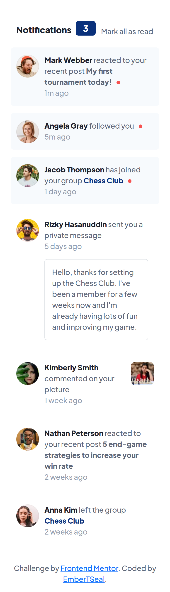
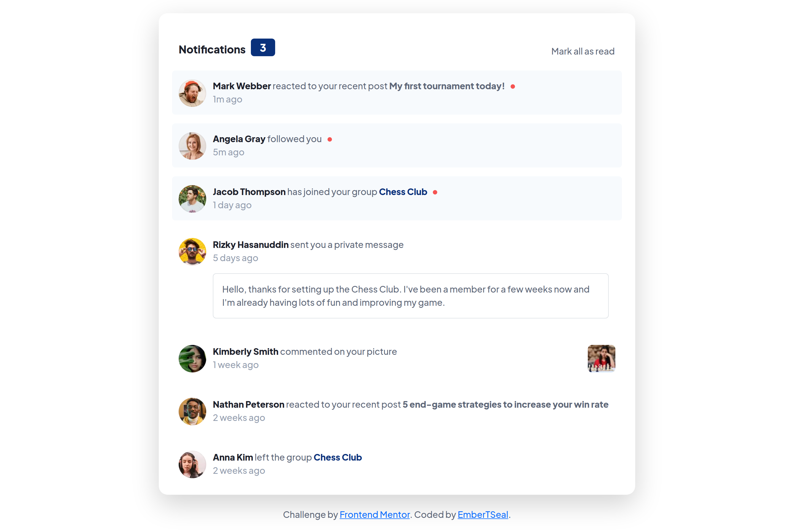

# Frontend Mentor - Notifications page solution

This is a solution to the [Notifications page challenge on Frontend Mentor](https://www.frontendmentor.io/challenges/notifications-page-DqK5QAmKbC). Frontend Mentor challenges help you improve your coding skills by building realistic projects. 

## Table of contents

- [Overview](#overview)
  - [The challenge](#the-challenge)
  - [Screenshot](#screenshot)
  - [Links](#links)
- [My process](#my-process)
  - [Built with](#built-with)
  - [What I learned](#what-i-learned)
  - [Useful resources](#useful-resources)
- [Author](#author)

## Overview

### The challenge

Users should be able to:

- Distinguish between "unread" and "read" notifications
- Select "Mark all as read" to toggle the visual state of the unread notifications and set the number of unread messages to zero
- View the optimal layout for the interface depending on their device's screen size
- See hover and focus states for all interactive elements on the page

### Screenshot

#### Mobile (375px):

#### Laptop (1440px):

### Links

- Solution URL: [Add solution URL here](https://github.com/EmberTSeal/Challenges/tree/main/NotificationPage)
- Live Site URL: [Add live site URL here](https://embertseal.github.io/Challenges/NotificationPage)

## My process

### Built with

- Semantic HTML5 markup
- Bootstrap
- Mobile-first workflow

### What I learned

- Making elements keyboard focusable using tabindex attribute
- Brushed up bootstrap and flexbox skills

### Useful resources

- [Keyboard Accessibility - MDN](https://developer.mozilla.org/en-US/docs/Web/Accessibility/Understanding_WCAG/Keyboard) - This helped me to make certain elements keyboard focusable for accessibility.

## Author

- LinkedIn - [Trisha Seal](https://www.linkedin.com/in/trisha-seal-617a89244/)
- Frontend Mentor - [@EmberTSeal](https://www.frontendmentor.io/profile/EmberTSeal)
- Github - [@EmberTSeal](https://github.com/EmberTSeal)

